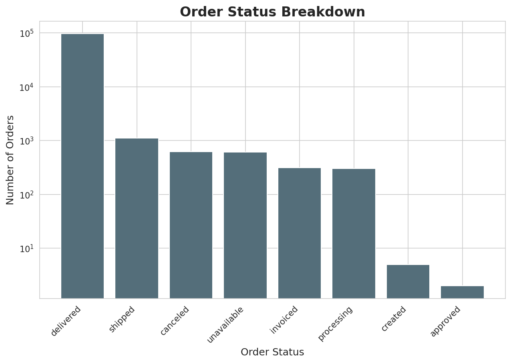
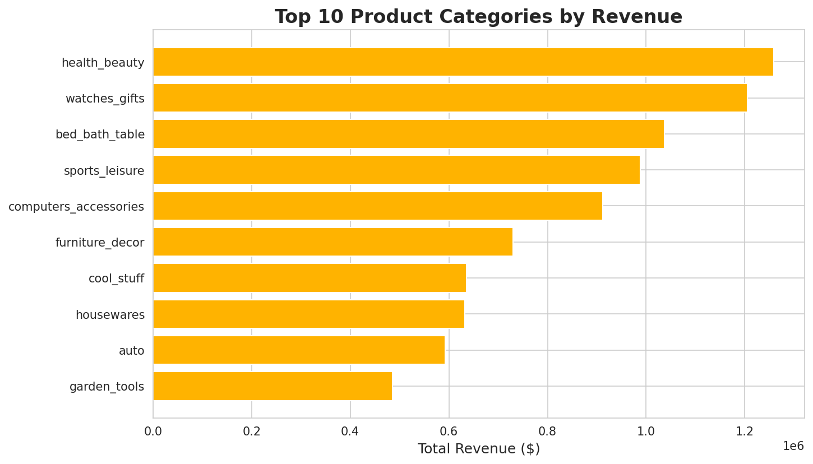
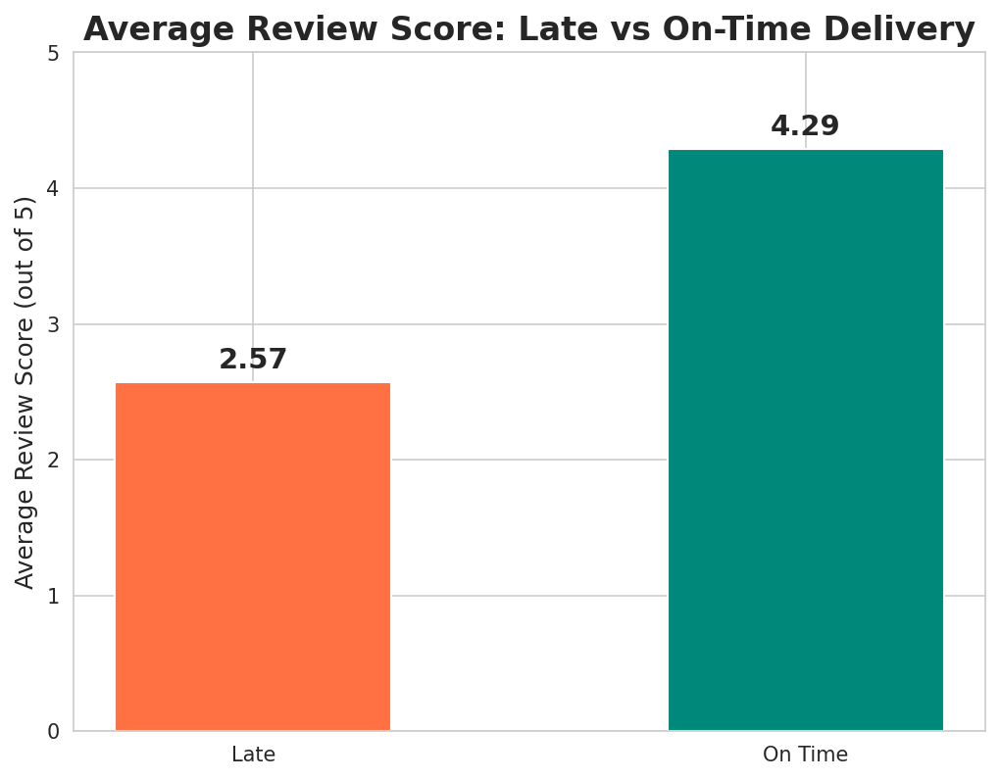
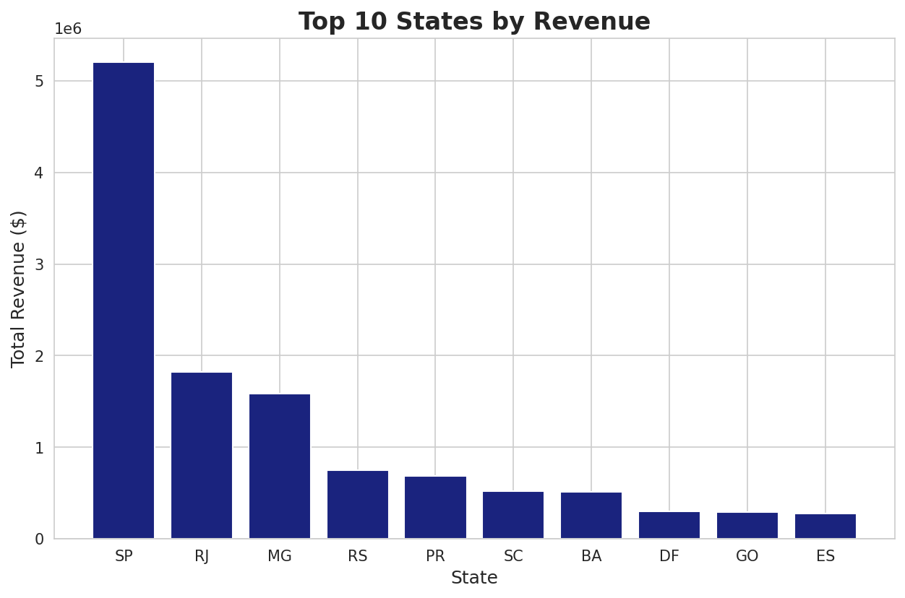
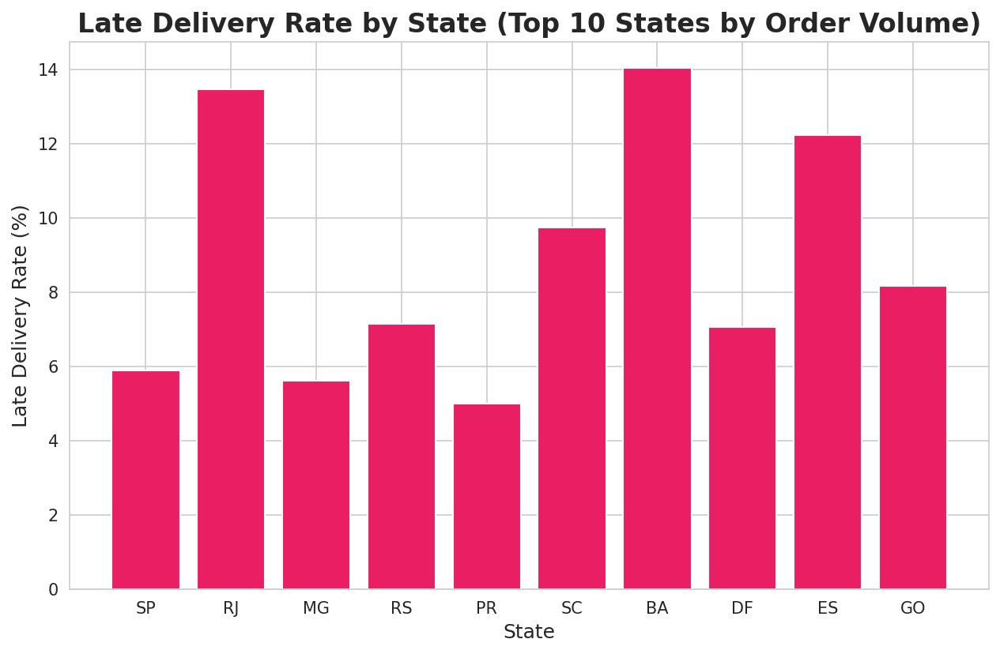

# E-commerce-Order-Delivery-Performance-Analysis
SQL and Python analysis of 99K e-commerce orders — identifies how delivery delays impact customer reviews and where regional logistics improvements should be prioritised.
## Business Problem
An e-commerce company processes 100,000+ orders but receives mixed customer 
reviews. This project investigates whether delivery performance affects 
customer satisfaction, where revenue is concentrated, and where the company 
should focus operational improvements.

---

## Key Business Insights

| Insight | Finding |
|---------|---------|
| Order Fulfillment | 97% of orders delivered successfully; 1.24% cancelled/unavailable |
| Top Revenue Category | Health & Beauty — $1.26M from 8,836 orders |
| Payment Behaviour | Credit card accounts for 74% of total revenue |
| Late Delivery Rate | 8.11% of orders delivered late |
| **Delivery Impact on Reviews** | **Late orders score 2.57/5 vs 4.29/5 for on-time orders** |
| Revenue Concentration | São Paulo (SP) generates 42% of total revenue |
| Regional Delivery Risk | Bahia (BA), Rio de Janeiro (RJ), and Espírito Santo (ES) have 2x+ the late delivery rate of other states |
| **Hidden Risk in Top Segment** | Health & Beauty orders in SP have a 7.76% late delivery rate — higher than SP's overall rate (5.89%), affecting the company's most valuable customer segment |

---

## Visualisations

### 1. Order Status Breakdown

### 2. Top 10 Product Categories by Revenue

### 3. Late vs On-Time Delivery — Review Score Impact

### 4. Revenue by State

### 5. Late Delivery Rate by State

---

## Business Recommendations

1. **Prioritise logistics improvement in BA, RJ, and ES** — these states have more than double the late delivery rate of better-performing states, directly damaging customer satisfaction.

2. **Investigate Health & Beauty fulfilment in SP specifically** — despite SP having a strong overall delivery record, its top revenue category underperforms the state average. This is the company's highest-value segment and deserves dedicated attention.

3. **Diversify revenue concentration** — with SP contributing 42% of revenue and Health & Beauty as the top category, the business carries concentration risk. Growth strategies should consider strengthening other regions and categories.

4. **Treat delivery delays as a customer experience priority, not just an operational metric** — the drop from 4.29 to 2.57 in review scores shows late delivery has a disproportionate impact on brand perception relative to its 8% frequency.

---

## Tools Used
- Python (Pandas, Matplotlib, Seaborn)
- SQL (SQLite) — joins across 8 relational tables
- Google Colab

## Dataset
Brazilian E-Commerce Public Dataset by Olist — [Kaggle](https://www.kaggle.com/datasets/olistbr/brazilian-ecommerce)  
99,441 orders | 9 relational tables
